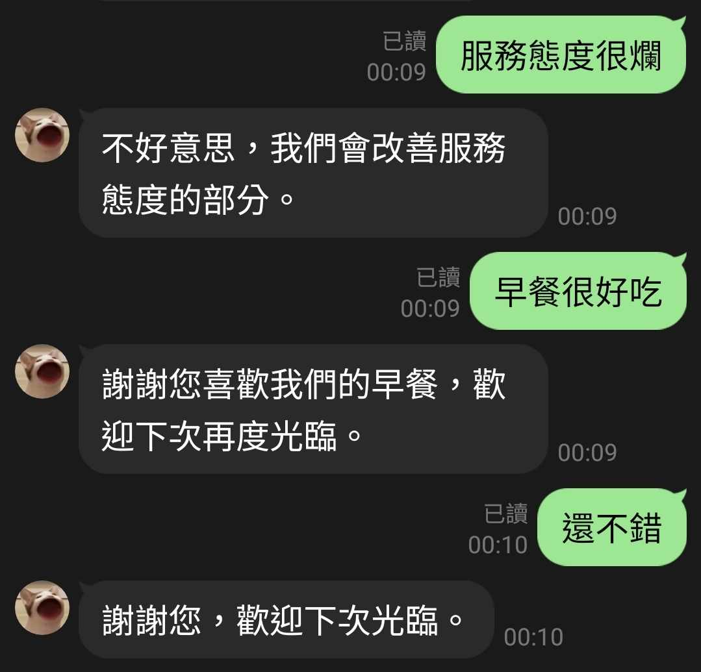

## Level 1
直接辨識訊息內容為 positive/negetive/netural(系統原定)
 ```js
    async function MS_TextSentimentAnalysis(thisEvent){
    console.log("[MS_TextSentimentAnalysis] in");
    const analyticsClient = new TextAnalyticsClient(endpoint, new AzureKeyCredential(apiKey));
    let documents = [];
    documents.push(thisEvent.message.text);
    //documents.push("早餐好吃")
    const results = await analyticsClient.analyzeSentiment(documents);
    console.log("[results]",JSON.stringify(results));

    const echo = {
        type:'text',
        text:results[0].sentiment
      };
    
    return client.replyMessage(thisEvent.replyToken, echo);
 ```

***
## Level 2
將系統原訂標籤改成中文(正向/負向/中性)，並顯示信心指數
 ```js
async function MS_TextSentimentAnalysis(thisEvent){
  console.log("[MS_TextSentimentAnalysis] in");
  const analyticsClient = new TextAnalyticsClient(endpoint, new AzureKeyCredential(apiKey));
  let documents = [];
  documents.push(thisEvent.message.text);
  const results = await analyticsClient.analyzeSentiment(documents);
  console.log("[results]",JSON.stringify(results));

  let sentiment = results[0].sentiment;
  let confidenceScores = results[0].confidenceScores;
  let confidence = `Positive: ${confidenceScores.positive.toFixed(2)}, Neutral: ${confidenceScores.neutral.toFixed(2)}, Negative: ${confidenceScores.negative.toFixed(2)}`;

  let sentimentText = '';
  switch(sentiment) {
      case 'positive':
          sentimentText = '積極的';
          break;
      case 'neutral':
          sentimentText = '中立的';
          break;
      case 'negative':
          sentimentText = '負面的';
          break;
      default:
          sentimentText = sentiment;
          break;
  }

  const echo = {
      type:'text',
      text:`${sentimentText} (信心值: ${confidence})`
  };
  
  return client.replyMessage(thisEvent.replyToken, echo);
}
 ```

***
## Level 3
客製化回覆，針對訊息主詞套入正/負向句型
 ```js
async function MS_TextSentimentAnalysis(thisEvent){
  console.log("[MS_TextSentimentAnalysis] in");
  const analyticsClient = new TextAnalyticsClient(endpoint, new AzureKeyCredential(apiKey));
  let documents = [];
  documents.push(thisEvent.message.text);
  const results = await analyticsClient.analyzeSentiment(documents, "zh-Hant", { includeOpinionMining: true });
  console.log("[results]", JSON.stringify(results));
  const score = results[0].confidenceScores;
  const sentiment = results[0].sentiment;
  let replyText = '';
  if (sentiment === 'positive') {
      if (results[0].sentences[0].opinions && results[0].sentences[0].opinions.length > 0) {
          replyText = `謝謝您喜歡我們的${results[0].sentences[0].opinions[0].target.text}，歡迎下次再度光臨。`;
      } else {
          replyText = '謝謝您，歡迎下次光臨。';
      }
  } else if (sentiment === 'negative') {
      if (results[0].sentences[0].opinions && results[0].sentences[0].opinions.length > 0) {
          replyText = `不好意思，我們會改善${results[0].sentences[0].opinions[0].target.text}的部分。`;
      } else {
          replyText = '不好意思，我們會努力改進。';
      }
  } else {
      replyText = '謝謝您，歡迎下次光臨。';
  }
  
  console.log("[opinions]", results[0].sentences[0].opinions);

  const echo ={
      type: 'text',
      text: replyText
  };
  
  return client.replyMessage(thisEvent.replyToken, echo);   
}
 ```
 