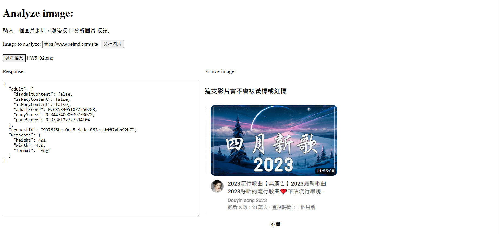
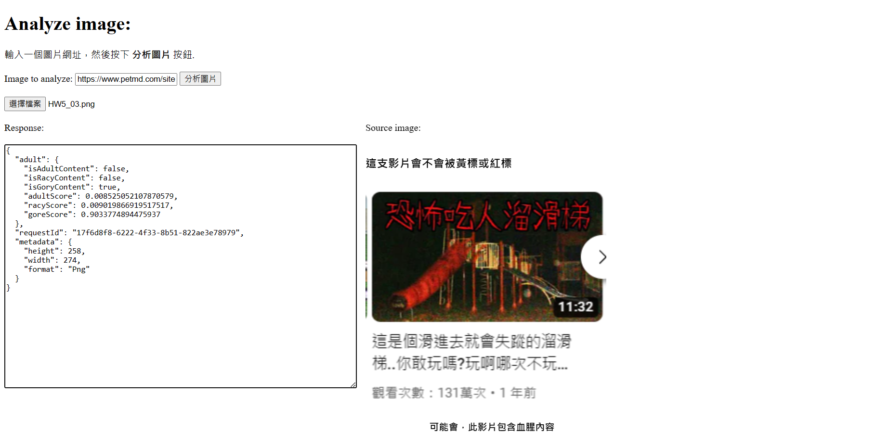

# 由影片封面判斷該 youtube 影片有沒有可能被上黃標或紅標

註:為了杜絕以極度血腥等場面吸引點擊率賺錢的做法，YouTube 公司設立綠、黃、紅標的分級機制。 綠標影片對廣告收益沒有特別限制，紅標影片完全不會分得廣告收益，黃標影片則介乎其中

---

## 測試 1



---

## 測試 2



## 程式碼

```js
.done(function (data) {
      //顯示JSON內容
      $("#responseTextArea").val(JSON.stringify(data, null, 2));
      $("#picDescription").empty();
      if (
        data.adult.isAdultContent === false &&
        data.adult.isRacyContent === false &&
        data.adult.isGoryContent === false
      ) {
        $("#picDescription").append("不會");
      } else if (data.adult.isAdultContent === true) {
        $("#picDescription").append("可能會，此影片包含成人內容");
      } else if (data.adult.isRacyContent === true) {
        $("#picDescription").append("可能會，此影片包含色情內容");
      } else if (data.adult.isGoryContent === true) {
        $("#picDescription").append("可能會，此影片包含血腥內容");
      }
    })
```
